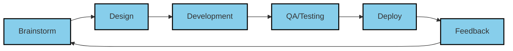

# Agile Development Methodology

## Circular Iterative Process:

## Agile Sprint Cycle:

**1. Brainstorm** → Requirements gathering and user stories  
**2. Design** → Architecture documents and prototypes  
**3. Development** → Sprint-based coding (2-week iterations)  
**4. QA/Testing** → Quality assurance and daily scrums  
**5. Deploy** → Production release and support  
**6. Feedback** → Demo review → **Loop back to Brainstorm**

---

**Note:** For the exact circular design with colorful rounded boxes like your reference image, use PowerPoint or Draw.io. Mermaid cannot create curved circular layouts.
