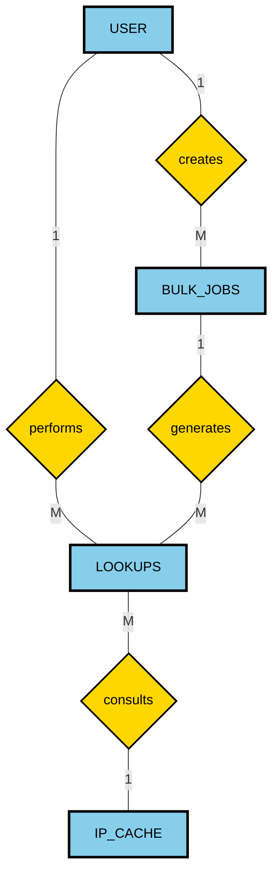

# Entity-Relationship Diagram (VPN Detector)

## Chen Notation - Traditional E-R Diagram

---

## E-R Diagram Components

### Entities (Rectangles):
- **USER** - Registered users with authentication (NFR-002)
- **BULK_JOBS** - CSV batch processing jobs (FR-006)
- **LOOKUPS** - Audit trail of all IP detections (FR-007)
- **IP_CACHE** - Redis cache for fast lookups (NFR-001 <150ms)

### Relationships (Diamonds):
- **performs** - USER creates individual IP lookups
- **creates** - USER initiates bulk processing jobs
- **generates** - BULK_JOBS produce multiple lookup records
- **consults** - LOOKUPS query cached IP data

### Cardinality:
- **1:M** (One-to-Many) relationships between all entities
- One user → Many lookups
- One user → Many bulk jobs
- One bulk job → Many lookups
- Many lookups → One cached IP

---

## Database Implementation Notes:
- **USER**: Stores JWT tokens, bcrypt hashed passwords, role-based access
- **BULK_JOBS**: Tracks async job status (queued/processing/complete)
- **LOOKUPS**: Contains verdict, confidence score, WHOIS JSON data
- **IP_CACHE**: TTL-based expiration for warm cache performance
