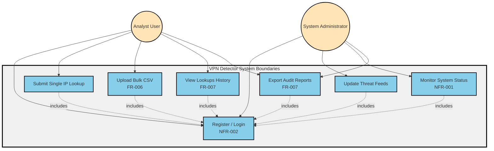

# Use Case Diagram - VPN and Proxy Detector

---

## Actors

### 1. Analyst User
**Primary investigator performing IP/domain analysis**
- **Role**: Front-line user conducting threat detection
- **Permissions**: Standard user access (analyst role)
- **Primary Use Cases**:
  - Register/Login (NFR-002: Authentication)
  - Submit Single IP Lookup
  - Upload Bulk CSV (FR-006: Batch processing)
  - View Lookups History (FR-007: Audit trail)
  - Export Audit Reports (FR-007: Compliance)

### 2. System Administrator
**Technical staff managing platform operations**
- **Role**: System maintenance and monitoring
- **Permissions**: Admin role with elevated access
- **Primary Use Cases**:
  - Register/Login (NFR-002: Authentication)
  - Update Threat Feeds (IP intelligence updates)
  - Monitor System Status (NFR-001: <150ms performance)
  - Export Audit Reports (FR-007: System auditing)

---

## Use Cases

| Use Case | Description | Requirements |
|----------|-------------|--------------|
| **Register / Login** | User authentication with JWT tokens | NFR-002 (bcrypt hashing) |
| **Submit Single IP Lookup** | Real-time IP/domain detection | NFR-001 (<150ms warm cache) |
| **Upload Bulk CSV** | Async batch processing via Socket.io | FR-006 (progress tracking) |
| **View Lookups History** | Browse audit trail with filters | FR-007 (MongoDB persistence) |
| **Export Audit Reports** | Download CSV/JSON compliance reports | FR-007 (audit logs) |
| **Update Threat Feeds** | Admin updates to VPN range data | Admin-only operation |
| **Monitor System Status** | Real-time dashboard (uptime, latency) | NFR-001 (performance monitoring) |

---

## Use Case Relationships

- **Include**: All use cases require **Register/Login** (shown with dotted arrows)
- **Actor Overlap**: Both actors can Export Audit Reports and must authenticate
- **Role Separation**: Only Admins can Update Threat Feeds and Monitor System Status
